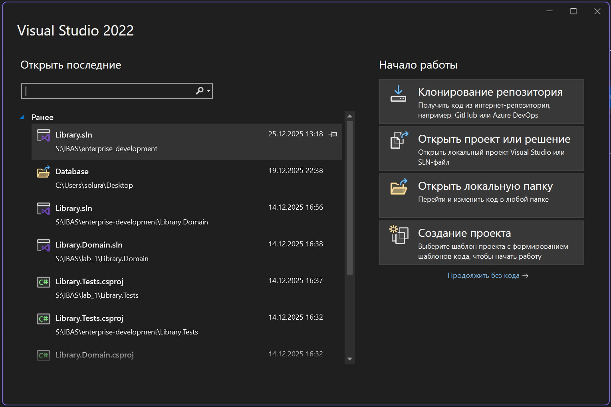
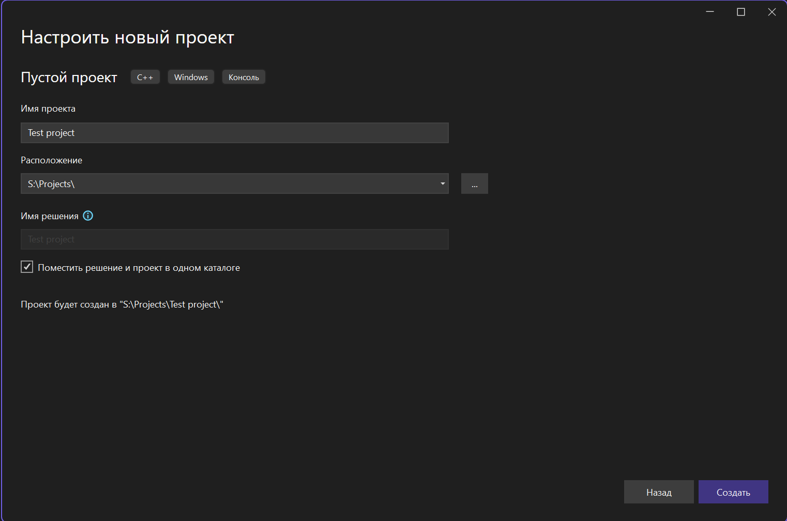
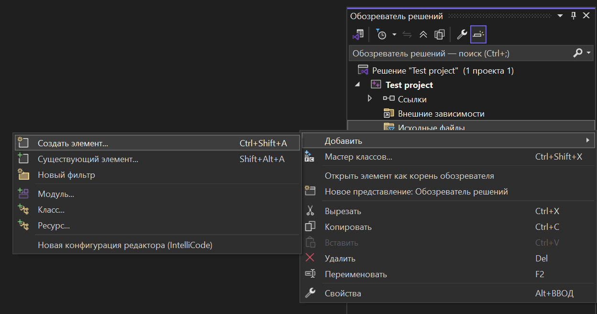

# Первая программа на C (Visual Studio 2022)

---

В этом уроке мы:

- создадим новый проект
- добавим исходный файл
- напишем первую программу на C
- запустим её
- разберём код построчно

---
## Шаг 1. Создание нового проекта

Запустите **Visual Studio 2022**.

В стартовом окне нажмите:

> **Создание проекта**



---

## Шаг 2. Выбор шаблона проекта

В списке шаблонов выберите:

> **Пустой проект (C++, Windows, Консоль)**
> 

Нажмите **Далее**.


---

## Шаг 3. Настройка проекта

Укажите:

- **Имя проекта** — например: `Test project`
- **Расположение** — выберите удобную папку
- Галочку **«Поместить решение и проект в одном каталоге»** оставить включённой

Нажмите **Создать**.



После создания откроется **Обозреватель решений**.


---

## 🔹 Шаг 4. Добавление исходного файла

В обозревателе решений:

1. Нажмите правой кнопкой на **Исходные файлы**
2. Выберите **Добавить → Создать элемент**
3. Назовите файл: first_programm.cpp

Нажмите **Добавить**.



---

## Шаг 5. Написание кода

В открывшемся файле вставьте следующий код:

```c
#include <stdio.h>

int main(void)
{
    printf("Hello world!\n");
    return 0;
}
```
Сохраните файл (Ctrl + S).


## Шаг 6. Запуск программы

Нажмите:

> ▶ **Запуск без отладки** (`Ctrl + F5`)


После запуска откроется окно консоли.


Если вы видите: 
>Hello world!

— **программа работает корректно** ✅


# Разбор программы

Теперь разберём код построчно.

## Подключение библиотеки

```c
#include <stdio.h>
```

Директива `#include` подключает заголовочный файл.
Файл **stdio.h** содержит определение функции `printf`,
которая используется для вывода текста в консоль.
Без этой строки `printf` работать не будет.

---

## Функция `main`

```c
int main(void)
```

Каждая программа на **C** обязательно должна содержать функцию `main`.
С неё начинается выполнение программы.

Разберём подробнее:

- `int` — функция возвращает целое число.
- `void` — функция не принимает параметров.

---

## Тело функции

```c
{
    printf("Hello world!");
    return 0;
}
```

Фигурные скобки `{}` — это тело функции.

### 🔹 Вывод строки

```c
printf("Hello world!\n");
```

- `printf` — функция вывода текста.
- `"Hello world!"` — строка.
- `\n` — символ переноса строки.
- В конце каждой команды ставится **точка с запятой** `;`.

### Завершение программы

```c
return 0;
```

Функция `main` должна вернуть целое число.
`0` означает **успешное завершение программы**.
Любое другое значение обычно означает **ошибку**.

---

## Важно понимать

- Программа начинается с `main`.
- Код выполняется **сверху вниз**.
- Без `#include <stdio.h>` функция `printf` не будет определена.
- После каждой инструкции ставится `;`.

---

## Итог

Вы:

- Создали проект.
- Добавили исходный файл.
- Написали код.
- Успешно запустили программу.
- Разобрали структуру программы на **C**.

Это **фундамент языка C**. Дальше будет только интереснее 
